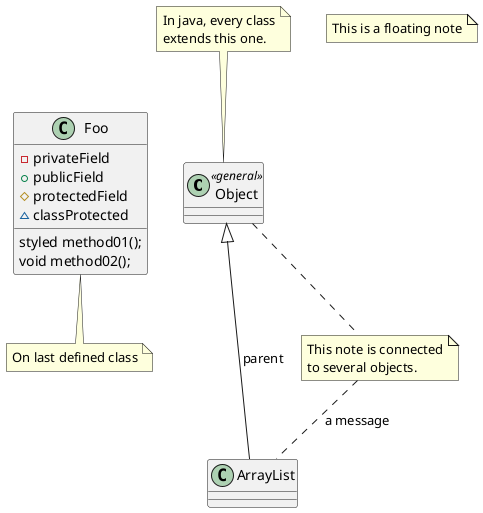
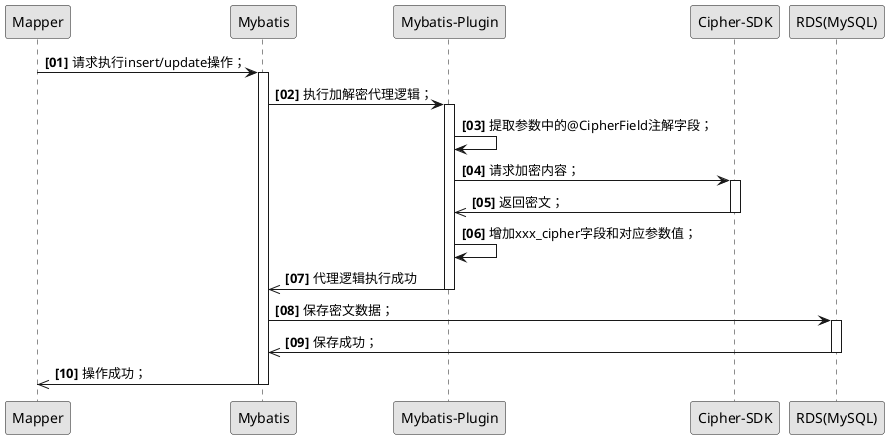

[PlantUML](https://plantuml.com/zh/) 是一个开源项目，支持快速绘制：[时序图](https://plantuml.com/zh/sequence-diagram)、[用例图](https://plantuml.com/zh/use-case-diagram)、[类图](https://plantuml.com/zh/class-diagram)、[对象图](https://plantuml.com/zh/object-diagram)、[活动图](https://plantuml.com/zh/activity-diagram-beta)、[组件图](https://plantuml.com/zh/component-diagram)、[部署图](https://plantuml.com/zh/deployment-diagram)、[状态图](https://plantuml.com/zh/state-diagram)、[定时图](https://plantuml.com/zh/timing-diagram)等常规UML图，还支持一些非UML图：[JSON 数据](https://plantuml.com/zh/json)、[YAML 数据](https://plantuml.com/zh/yaml)、[网络图 (nwdiag)](https://plantuml.com/zh/nwdiag)、[线框图形界面](https://plantuml.com/zh/salt)、[架构图](https://plantuml.com/zh/archimate-diagram)、[规范和描述语言 (SDL)](https://plantuml.com/zh/activity-diagram-beta#sdl)、[Ditaa 图](https://plantuml.com/zh/ditaa)、[甘特图](https://plantuml.com/zh/gantt-diagram)、[思维导图](https://plantuml.com/zh/mindmap-diagram)、[WBS 工作分解图](https://plantuml.com/zh/wbs-diagram)、[以 AsciiMath 或 JLaTeXMath 符号的数学公式](https://plantuml.com/zh/ascii-math)、[实体关系图](https://plantuml.com/zh/ie-diagram)等。可以生成PNG，[SVG](https://plantuml.com/zh/svg) 或 [LaTeX](https://plantuml.com/zh/latex) 格式的图片。也可以生成 [ASCII艺术图](https://plantuml.com/zh/ascii-art)（仅限时序图）。


<!--more-->

## 常用样式

由于默认的样式比较单一，开源社区中有很多优化方案。

### 1、RedDress-PlantUML

使用方法：

定义主题风格（`LIGHTORANGE`），然后引入主题样式库。

```plantuml
@startuml
!define LIGHTORANGE
!includeurl https://gitee.com/dotions/RedDress-PlantUML/raw/master/style.puml
' 这里写自己的plantuml代码
@enduml
```

可选的主题风格：

- `DARKBLUE` （深蓝色）
- `LIGHTBLUE`（浅蓝色）
- `DARKRED`（深红色）
- `LIGHTRED`（浅红色）
- `DARKGREEN`（深绿色）
- `LIGHTGREEN`（浅绿色)
- `DARKORANGE`（深橙色)
- `LIGHTORANGE`（浅橙色）

案例：



效果：


### 2、PlantUML Icon-Font Sprites

使用方式：

导入sprites：

```
!define ICONURL https://gitee.com/dotions/plantuml-icon-font-sprites/raw/master/
!includeurl ICONURL/common.puml
!includeurl ICONURL/devicons/mysql.puml
!includeurl ICONURL/font-awesome/database.puml
!includeurl ICONURL/font-awesome-5/database.puml
```

#### 2.1 icon 集合

| Name                                                       | Index                                                        |
| ---------------------------------------------------------- | ------------------------------------------------------------ |
| [Font-Awesome 4](https://fontawesome.com/v4.7.0/)          | [List of macros](https://gitee.com/dotions/plantuml-icon-font-sprites/blob/master/font-awesome/index.md) |
| [Font-Awesome 5](http://fontawesome.io/)                   | [List of macros](https://gitee.com/dotions/plantuml-icon-font-sprites/blob/master/font-awesome-5/index.md) |
| [Devicons](http://vorillaz.github.io/devicons)             | [List of macros](https://gitee.com/dotions/plantuml-icon-font-sprites/blob/master/devicons/index.md) |
| [Govicons](http://govicons.io/)                            | [List of macros](https://gitee.com/dotions/plantuml-icon-font-sprites/blob/master/govicons/index.md) |
| [Weather](https://erikflowers.github.io/weather-icons/)    | [List of macros](https://gitee.com/dotions/plantuml-icon-font-sprites/blob/master/weather/index.md) |
| [Material](http://google.github.io/material-design-icons/) | [List of macros](https://gitee.com/dotions/plantuml-icon-font-sprites/blob/master/material/index.md) |
| [Devicon 2](https://github.com/devicons/devicon.git)       | [List of macros](https://gitee.com/dotions/plantuml-icon-font-sprites/blob/master/devicons2/index.md) |

案例：

```plantuml
@startuml

skinparam defaultTextAlignment center

!define ICONURL https://gitee.com/dotions/plantuml-icon-font-sprites/raw/master/

!includeurl ICONURL/common.puml
!includeurl ICONURL/devicons/mysql.puml
!includeurl ICONURL/font-awesome/server.puml
!includeurl ICONURL/font-awesome-5/database.puml

title Styling example

FA_SERVER(web1,WEB1) #Green
FA_SERVER(web2,WEB1) #Yellow
FA_SERVER(web3,WEB1) #Blue
FA_SERVER(web4,WEB1) #YellowGreen

FA5_DATABASE(db1,LIVE,database,white) #RoyalBlue
DEV_MYSQL(db2,SPARE,database) #Red

db1 <--> db2

web1 <--> db1
web2 <--> db1
web3 <--> db1
web4 <--> db1

@enduml
```

效果图：


## 3、自带样式风格

通过 `skinparam monochrome true` 设置为黑白风格。

通过 `autonumber 1 1 "<b>[00]</b>"` 实现序号自增；

案例：



效果图：


